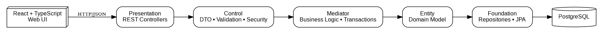
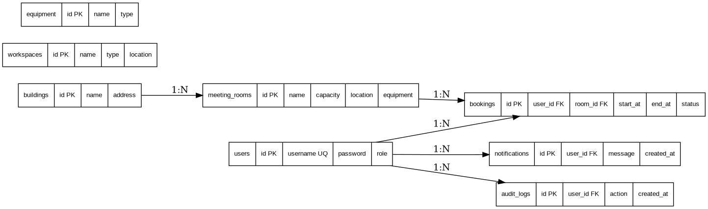
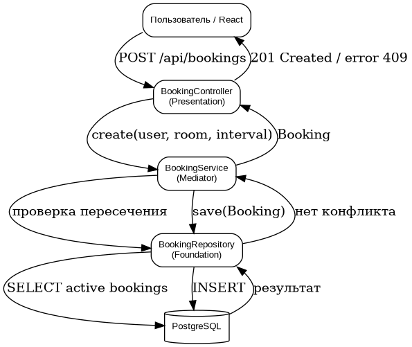
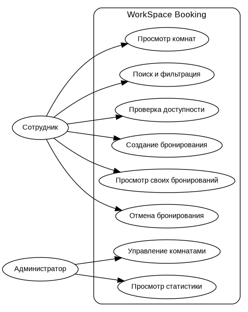

# WorkSpace Booking

Курсовой проект по дисциплине «Программная инженерия».

**Тема:** Разработка веб-сервиса для поиска и бронирования переговорных комнат и управления рабочими пространствами.

**Студент:** Гусейнов Омарасхаб Назимович  
**Группа:** ПИЖ-б-о-23-1  
**Руководитель:** Новикова Е.Н., канд. физ.-мат. наук, заведующий межинститутской базовой кафедрой

## Назначение системы

WorkSpace Booking предназначен для поиска переговорных комнат, проверки их доступности, создания и отмены бронирований, а также для административного управления комнатами и просмотра статистики.

## Технологический стек

- Java 21
- Spring Boot 3.5
- Spring Security
- Spring Data JPA / Hibernate
- PostgreSQL
- React + TypeScript + Vite
- Docker Compose
- JUnit 5 + Mockito + MockMvc + JaCoCo

## Архитектура

Система организована по архитектурному паттерну PCMEF:

`Presentation → Control → Mediator → Entity → Foundation`

- **Presentation** — REST-контроллеры и пользовательский интерфейс.
- **Control** — DTO, валидация и управление доступом.
- **Mediator** — бизнес-логика и транзакционные операции.
- **Entity** — предметные сущности и их состояние.
- **Foundation** — репозитории и взаимодействие с PostgreSQL.

## Структура репозитория

```text
backend/                    Серверная часть Spring Boot
frontend/                   Клиентская часть React + TypeScript
database/                   SQL-схема базы данных
docs/00-initiation/         Инициация и бизнес-анализ
docs/01-requirements/       Требования
docs/02-architecture/      Архитектура PCMEF и ADR
docs/03-database/           Проектирование БД
docs/04-design/             Детальное проектирование
docs/05-implementation/     Реализация и тестирование
docs/06-refactoring/        Рефакторинг и качество
docs/07-management/        WBS, Gantt, COCOMO и управление
docs/08-explanatory-note/   Пояснительная записка
docs/images/                Диаграммы и скриншоты
scripts/                    Скрипты проверки проекта
```

## Запуск

### Вариант через Docker Compose

```bash
docker compose up --build
```

Frontend: `http://localhost:5173`  
Backend: `http://localhost:8080`  
Swagger UI: `http://localhost:8080/swagger-ui.html`

### Локальная проверка

Backend:

```bash
cd backend
./mvnw test
```

Frontend:

```bash
cd frontend
npm install
npm run build
```

Windows PowerShell:

```powershell
./scripts/verify.ps1
```

## Основной сценарий демонстрации

1. Авторизация пользователя.
2. Просмотр доступных переговорных комнат.
3. Выбор комнаты и временного интервала.
4. Создание бронирования.
5. Просмотр собственных бронирований.
6. Отмена бронирования.
7. Авторизация администратора.
8. Управление комнатами и просмотр административной статистики.

## Безопасность

Для аутентификации используется JWT. Пароли хранятся в хешированном виде. Доступ к административным операциям ограничен ролью `ROLE_ADMIN`, а пользовательские операции выполняются в рамках роли `ROLE_USER`.

Защищённые запросы передают токен в заголовке:

```http
Authorization: Bearer <token>
```

## Ключевое бизнес-правило

Активные бронирования одной переговорной комнаты не должны пересекаться по времени. Проверка конфликта выполняется в `BookingService` до сохранения нового бронирования.

## Документация

Полный комплект проектной документации расположен в каталоге `docs/`.

В репозитории также сохранены визуальные материалы:









## Статистика разработки

> Финальные скриншоты GitHub Insights добавляются после публикации репозитория. На момент сдачи должны быть представлены графики Commit Activity и Punch Card, а также общее количество коммитов и период разработки.

## Проверка соответствия методическим требованиям

Сводная матрица находится в [`docs/07-management/compliance-matrix.md`](docs/07-management/compliance-matrix.md).
